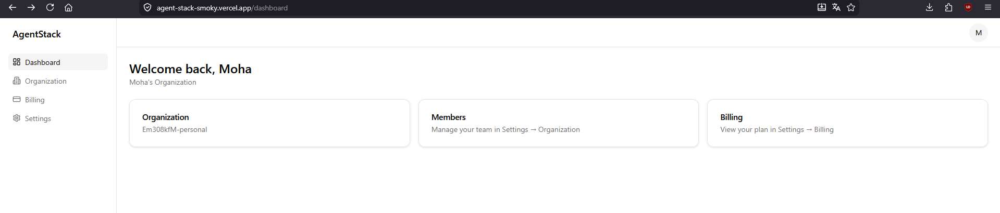

# AgentStack

[](https://claude.com/claude-code)
[](./LICENSE)
[](https://agent-stack-smoky.vercel.app)

The only SaaS boilerplate designed to be extended by AI agents, not just cloned. Auth, billing, and a multi-tenant dashboard ship out of the box — plus three ready-to-use Claude Code skills that let an agent add features for you, in your codebase's own style.

**[Live demo →](https://agent-stack-smoky.vercel.app)**



## Stack

Next.js 15 (App Router) · TypeScript · Tailwind CSS · Shadcn UI · Drizzle ORM · PostgreSQL (Neon-compatible) · Better Auth (email/password + Google OAuth) · Stripe (subscriptions + customer portal + webhooks) · React Email + Resend.

## Setup (5 minutes)

```bash
git clone https://github.com/its-shitzu/AgentStack.git agentstack
cd agentstack
pnpm install
cp .env.example .env.local   # fill in DATABASE_URL, BETTER_AUTH_SECRET, etc.
pnpm db:push                 # create tables from src/db/schema
pnpm dev
```

Open `http://localhost:3000`, sign up, and you'll land on the dashboard with a personal organization already created.

Minimum to get auth + DB working locally: a Postgres connection string (a free [Neon](https://neon.tech) database works) and a `BETTER_AUTH_SECRET` (`openssl rand -base64 32`). Stripe and Google OAuth are optional until you need billing/social login — see `.env.example`.

## Project structure

See [AGENTS.md](./AGENTS.md) for the full architecture map (where models/routes/components live, naming conventions, data model). It's written for both humans and AI agents.

## The 3 Claude Code skills

Located in `.claude/skills/`. Each one reads the existing codebase patterns before generating anything, so output matches your conventions instead of inventing new ones.

### `add-crud-feature`

> "Add an Invoice resource with amount, status (draft/sent/paid), and a due date."

Generates: a Drizzle table scoped to `organizationId`, server actions (create/update/delete/list) with Zod validation, a dashboard page with a table + form, and a sidebar entry — wired together end to end.

### `add-dashboard-page`

> "Add an Analytics page to the dashboard."

Generates: a new route under `(dashboard)/` that inherits the existing sidebar/topbar/auth guard, laid out with the same Card-based pattern as the rest of the app, registered in navigation.

### `add-email-template`

> "Send an email when a subscription is canceled."

Generates: a React Email component in `src/emails/`, a typed `send<X>Email()` function in `src/lib/email.ts`, and wires the call into the right trigger point (e.g. the matching case in the Stripe webhook handler) — and tells you exactly where it hooked in.

## Tests

```bash
pnpm test
```

Covers the auth flow (signup → session → logout) and the Stripe webhook handler (valid signature processes `checkout.session.completed`, invalid signature is rejected with 400).

## License

MIT
